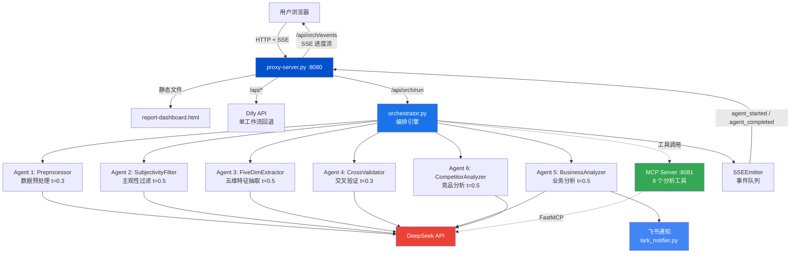

# 系统架构图



## 数据流

```
用户上传双文件 (.txt + .docx/.md)
  → proxy-server 解析 .docx
    → orchestrator 串行调用 5-6 个 Agent
      → 每个 Agent 调用 DeepSeek API + 可选 MCP 工具
        → SSE 实时推送进度到浏览器
          → 前端时间线实时更新
            → 分析完成 + 飞书通知
```

## 两种分析模式

| 模式 | 流水线 | LLM 调用 | 适用场景 |
|:---|:---|:---|:---|
| 深度（多 Agent） | Agent1→2→3→4→5 | 5 次 | 完整分析、进度可见 |
| 快速（单工作流） | Dify Workflow | 1 次 | 小文件、快速预览 |

| 场景 | 流水线 |
|:---|:---|
| 用户反馈分析 | Agent1→2→3→4→5 |
| 竞品分析 | Agent1→6→4→5 |

## 端口分配

| 端口 | 服务 | 协议 |
|:---|:---|:---|
| 8080 | HTTP 代理 + 静态文件 | HTTP/SSE |
| 8081 | MCP 工具服务 | streamable-http |
